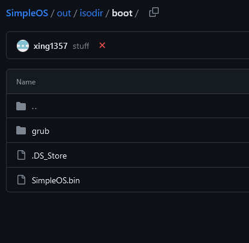

[Grub2 Documetation](https://www.gnu.org/software/grub/grub-documentation.html)

[HTML DOCS](https://www.gnu.org/software/grub/manual/grub/grub.html#Role-of-a-boot-loader)

# Understanding GRUB boot stages
## Stage 1 (boot.img):
MBR (Master Boot Record) Installation: GRUB's initial stage is typically installed in the Master Boot Record of the boot device (commonly the first sector of the hard disk).

Size Limitations: Stage 1 is small in size and has limited functionality due to the constraints of the MBR. Its main job is to locate and load the next stage.

## Stage 1.5 (core.img):

Filesystem Understanding: Stage 1.5 is often referred to as the "core image." It is necessary when GRUB needs to understand the filesystem to locate its configuration file and other components.

Partial Filesystem Support: At this stage, GRUB has a better understanding of the filesystem, allowing it to access files. It can load Stage 2 from a filesystem and has more features than Stage 1.

## Stage 2 (grub.cfg):

Configuration File Loading: Stage 2 loads the main configuration file, typically named grub.cfg. This file contains information about the available operating systems, kernel parameters, and other boot options.

User Interface: Stage 2 provides a more user-friendly interface, allowing users to choose from different operating systems or kernel options if multiple options are available.

Kernel Loading: Once the user makes a selection, Stage 2 loads the selected operating system's kernel into memory and transfers control to it.

## Kernel Stage:

Handover to the Operating System: At this point, GRUB has completed its tasks, and control is transferred to the kernel of the selected operating system. The kernel takes over the boot process and initializes the operating system.

# Installation

- GRUB comes with boot images
- the directory where GRUB images are initially placed (normally /usr/lib/grub/<cpu>-<platform>) will be called the image directory (isodir)
- the directory where the boot loader needs to find them (usually /boot) will be called the boot directory


    

## Installing GRUB using grub-install (on Partition)

- To install GRUB under a UNIX-like OS as superuser (root)
- Need to specify one argument: where to install the boot loader (Argument should be a device file)
- The typical usage is that you create a GRUB boot floppy with a filesystem.


```
grub-install /dev/sda
```

Example usage:

```
# mke2fs /dev/fd0
# mount -t ext2 /dev/fd0 /mnt
# mkdir /mnt/boot
# grub-install --boot-directory=/mnt/boot /dev/fd0
# umount /mnt
```

Some BIOSes have a bug of exposing the first partition of a USB drive as a floppy instead of exposing the USB drive as a hard disk. To fix:

```
# losetup /dev/loop0 /dev/sdb1
# mount /dev/loop0 /mnt/usb
# grub-install --boot-directory=/mnt/usb/bugbios --force --allow-floppy /dev/loop0
```


### mke2fs
mke2fs - create an ext2/ext3/ext4 filesystem 

# Making a GRUB bootable CD-ROM
- To prevent compatibility problems (confuse floppy or hard disk image file)
- To make a simple generic GRUB rescue CD, you can use the grub-mkrescue program

```
grub-mkrescue -o grub.iso
```

# Network boot loader
[Network](https://www.gnu.org/software/grub/manual/grub/grub.html#Network)
